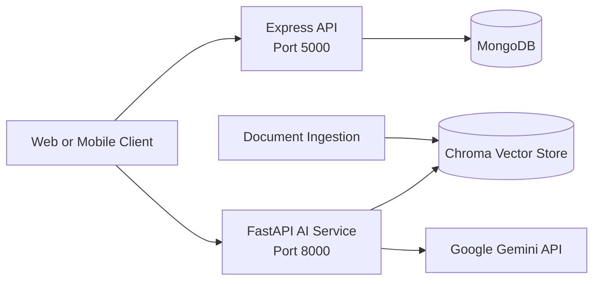

<div align="center">

# Kisan Setu

### A Digital Agriculture Support Platform for Indian Farmers


</div>

## 1. Project Overview

Kisan Setu is an agriculture-support platform designed to help farmers access practical crop guidance, discover mandi information, and maintain a record of their sales. The platform combines a conventional backend API with a retrieval-augmented AI assistant, **Kisan Setu AI Saathi**.

The project is intended to make agricultural information easier to access, support better market decisions, and provide guidance in English, Hindi, and Hinglish.

Kisan Setu provides a single platform with:

- A mandi directory with product prices and search support.
- Sales recording and farmer-specific sales history.
- A conversational AI assistant for agriculture-related questions.
- Document-grounded responses through a searchable agricultural knowledge base.
- Conversation continuity for follow-up questions.

## 2.  Expected Impact

- Faster access to understandable agricultural information.
- Better visibility into mandi prices and available products.
- Improved personal record keeping for farmers.
- A foundation for multilingual and scalable digital agriculture services.

## 3. Key Features

### Mandi and Market Services

- Create and list mandis.
- Search mandis by name, location, district, or product name.
- Identify the lowest matching product price in search results.
- View an individual mandi by ID.
- Update or delete a product listing within a mandi.

### Sales Management

- Record a farmer's sale with product, quantity, buyer, amount, and date.
- Retrieve sales for a farmer.
- Filter sales by product, year, or both product and year.

### Kisan Setu AI Saathi

- Chat through a FastAPI endpoint.
- Preserve conversation context using a conversation ID.
- Retrieve relevant content from agricultural documents.
- Generate answers using Google Gemini when configured.
- Return a structured response containing a title, answer, practical detail, and source.
- Respond in the user's language when supported by the model.

## 4. System Architecture



## 5. Technology Stack

| Layer | Technology |
| --- | --- |
| Market and sales API | Node.js, Express 5 |
| Data persistence | MongoDB with Mongoose |
| AI API | Python, FastAPI, Uvicorn |
| Retrieval pipeline | LangChain, ChromaDB |
| Embeddings | Hugging Face Sentence Transformers |
| Language model | Google Gemini through LangChain |
| Supported source documents | PDF, DOCX, and text/Markdown documents |
| Testing | Pytest, FastAPI TestClient |

## 6. Repository Structure

```text
KisanSetu/
├── Backend/
│   ├── server.js                 # Express server entry point
│   ├── package.json              # Node.js dependencies
│   └── src/
│       ├── app.js                # API routes and middleware
│       ├── db/db.js              # MongoDB connection
│       └── models/               # Mandi and Sale schemas
├── Rag/
│   └── ML_model/
│       ├── main.py               # FastAPI application
│       ├── api/chat.py           # Chat endpoint
│       ├── core/config.py        # Environment-backed settings
│       ├── ingestion/            # Document loading and chunking
│       ├── services/              # Chat, RAG, memory, and LLM services
│       ├── vectorstore/           # Chroma storage and retrieval
│       ├── data/documents/        # Knowledge-base documents
│       └── tests/                 # AI service tests
└── README.md
```

## 7. Prerequisites

- Node.js 18 or later.
- Python 3.10 or later.
- MongoDB running locally or a MongoDB connection URI.
- A Google AI API key for Gemini-powered responses. The API key is optional for starting the AI service, but required for generated answers.

## 8. Installation and Setup

### 8.1 Clone the Repository

```bash
git clone <repository-url>
cd KisanSetu
```

### 8.2 Configure the Express Backend

Create `Backend/.env`:

```env
PORT=5000
MONGO_URI=mongodb://127.0.0.1:27017/kisan_setu
```

Install dependencies and start the backend:

```bash
cd Backend
npm install
node server.js
```

The Express API is available at `http://localhost:5000`.

### 8.3 Configure the AI Service

Create `Rag/.env`:

```env
GOOGLE_API_KEY=your_google_api_key
FRONTEND_URL=http://localhost:5173
```

Install the Python dependencies from the repository root:

```bash
cd Rag/ML_model
python -m venv .venv
```

Activate the virtual environment:

```bash
# Windows PowerShell
.venv\Scripts\Activate.ps1

# macOS/Linux
source .venv/bin/activate
```

Install dependencies and start FastAPI:

```bash
pip install -r requirements.txt
cd ../..
uvicorn KisanSetu.Rag.ML_model.main:app --reload --port 8000
```

The AI service is available at `http://localhost:8000`. Interactive API documentation is available at `http://localhost:8000/docs`.

## 9. Knowledge-Base Ingestion

Place supported agricultural documents in `Rag/ML_model/data/documents/`, then run ingestion from the repository root with the AI virtual environment activated:

```bash
python -m KisanSetu.Rag.ML_model.ingestion.ingest
```

The command splits documents into chunks and stores their embeddings in the local Chroma persistence directory. Re-running ingestion uses stable chunk IDs to avoid duplicate chunks.

## 10. API Reference

### Express API

| Method | Endpoint | Purpose |
| --- | --- | --- |
| `POST` | `/sales` | Create a sale record |
| `GET` | `/sales?farmerId=<id>` | List a farmer's sales |
| `GET` | `/sales?farmerId=<id>&productId=<id>` | Filter by product |
| `GET` | `/sales?farmerId=<id>&year=<yyyy>` | Filter by year |
| `GET` | `/sales?farmerId=<id>&productId=<id>&year=<yyyy>` | Filter by product and year |
| `POST` | `/mandis` | Create a mandi |
| `GET` | `/mandis` | List all mandis |
| `GET` | `/mandis?search=<term>` | Search mandis or products |
| `GET` | `/mandis/:id` | Get one mandi |
| `PATCH` | `/mandis/:mandiId/products/:productId` | Update a product listing |
| `DELETE` | `/mandis/:mandiId/products/:productId` | Delete a product listing |

### AI API

#### `GET /health`

Returns the service health status.

#### `POST /chat`

Request:

```json
{
	"user_id": "farmer-001",
	"conversation_id": null,
	"message": "What should I do if my wheat leaves are turning yellow?"
}
```

Response:

```json
{
	"conversation_id": "conversation-id",
	"cardTitle": "KISAN SETU KA SUJHAAV",
	"answer": "Main agricultural guidance yahan dunga.",
	"detail": "Follow the recommended steps and consult a qualified officer when needed.",
	"source": "verified-wheat-guide.md"
}
```

## 11. Testing

Run the AI service tests from the repository root with the Python environment activated:

```bash
pytest Rag/ML_model/tests
```

The current test suite covers the health endpoint, the chat response contract, conversation continuity, and inclusion of retrieved document context in the RAG prompt.

## 12. Configuration Reference

The AI service supports these settings through `Rag/.env`:

| Variable | Default | Description |
| --- | --- | --- |
| `GOOGLE_API_KEY` | Not set | Enables Gemini responses |
| `LLM_MODEL` | `gemini-2.0-flash` | Gemini model name |
| `EMBEDDING_MODEL` | Multilingual MiniLM | Sentence Transformer model |
| `FRONTEND_URL` | `http://localhost:5173` | Allowed CORS origin(s) |
| `TOP_K` | `5` | Number of retrieved chunks |
| `CHUNK_SIZE` | `900` | Document chunk size |
| `CHUNK_OVERLAP` | `150` | Chunk overlap |
| `MEMORY_WINDOW` | `12` | Conversation history window |

Do not commit `.env` files or API keys to the repository.

## 13. Current Limitations

- Authentication and role-based access control are not currently implemented.
- Mandi and sales APIs require valid request data but do not yet expose a dedicated API schema document.
- AI answer quality depends on the configured model and the quality of ingested documents.
- Agricultural recommendations should be verified with a qualified agricultural officer for serious or location-specific crop issues.

## 14. Future Scope

- Farmer and administrator authentication.
- A responsive multilingual web or mobile interface.
- Live mandi-price integrations and location-based discovery.
- Weather, soil, and crop-health data integrations.
- Voice-based interaction for farmers with limited literacy or typing access.
- Stronger validation, observability, rate limiting, and deployment automation.

## 15. Conclusion

Kisan Setu establishes a practical technical foundation for an accessible, multilingual agricultural support system. By combining structured market and sales data with document-grounded conversational assistance, the platform can help farmers make more informed decisions while leaving room for future integrations and field-focused improvements.

## 16. License

This project is distributed under the license included in [LICENSE](LICENSE).
