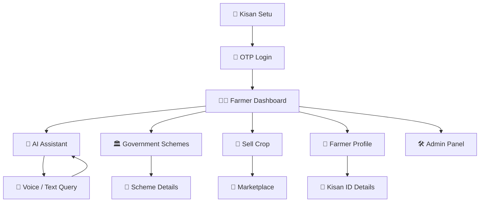
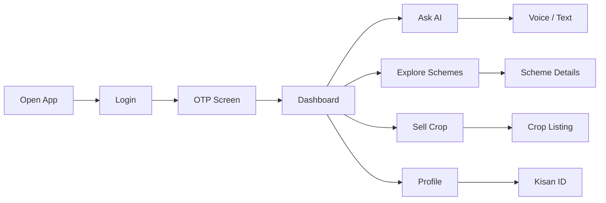
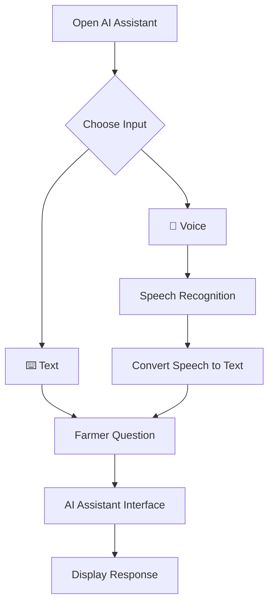
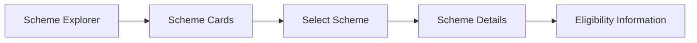
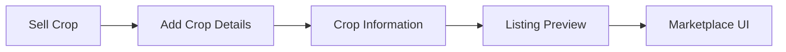

# 🌾 Kisan Setu — Frontend

> **Kisan Setu — Making digital agricultural services simpler for farmers.**

A mobile-first React frontend that helps Indian farmers access digital agricultural services through a simple, accessible, farmer-friendly interface.

**Note:** This is a frontend-only project. Backend services, databases, and server-side authentication are not included here.

---

## 🚜 What Kisan Setu Does

Kisan Setu simplifies how farmers reach agricultural information and services. With it, farmers can:

- Ask questions in **Hindi or English**
- Chat with an AI assistant
- Explore government schemes and check eligibility
- List crops for sale on a marketplace
- Manage their farmer profile and Kisan ID
- Use a clean, mobile-friendly dashboard

The goal is a clean, accessible experience — built especially for mobile devices.

---

## ⭐ Key Features

### 🔐 OTP Login
A simple, secure login flow built around OTP-based authentication.

### 👨‍🌾 Farmer Dashboard
Quick access to every core service a farmer needs, in one place.

### 🤖 AI Assistant
A chatbot-style interface supporting both text and voice input, in Hindi and English.

### 🎤 Voice Support
Uses browser speech APIs to convert spoken questions into text — no typing required.

### 🏛️ Scheme Explorer
Browse government agricultural schemes and view eligibility details at a glance.

### 🌾 Crop Marketplace
Add crop listings, preview them, and explore what other farmers are selling.

### 👤 Farmer Profile
A dedicated space for farmer details and Kisan ID information.

### 🛠️ Admin Dashboard
A management view for administrators overseeing the platform.

---

## 🔄 Application Flow



### 👨‍🌾 Farmer Journey



### 🤖 AI Assistant Flow



> Voice recognition depends on browser and device support.

### 🏛️ Government Scheme Flow



### 🌾 Crop Selling Flow



---

## 📁 Project Structure

```text
Kisan-Setu/
│
├── frontend/
│   │
│   ├── public/
│   │
│   ├── src/
│   │   ├── assets/
│   │   ├── components/
│   │   │
│   │   ├── pages/
│   │   │   ├── Login/
│   │   │   ├── Home/
│   │   │   ├── Chat/
│   │   │   ├── SellCrop/
│   │   │   ├── Schemes/
│   │   │   ├── Profile/
│   │   │   └── Admin/
│   │   │
│   │   ├── services/
│   │   │   └── api.js
│   │   │
│   │   ├── App.jsx
│   │   ├── main.jsx
│   │   └── index.css
│   │
│   ├── package.json
│   ├── vite.config.js
│   ├── .env.example
│   └── README.md
│
└── README.md
```

---

## 🛠️ Tech Stack

| Technology | Role |
|---|---|
| **React** | Frontend UI |
| **Vite** | Development & build tool |
| **JavaScript / JSX** | Application logic |
| **CSS** | Styling & responsive design |
| **Axios** | API integration |
| **Browser Speech APIs** | Voice input |
| **Responsive Design** | Mobile, tablet, desktop support |

---

## ⚙️ Getting Started

**1. Open the frontend folder**
```bash
cd frontend
```

**2. Install dependencies**
```bash
npm install
```

**3. Start the development server**
```bash
npm run dev
```

The app runs by default at:
```text
http://localhost:5173
```

---

## 🚀 Available Commands

| Command | Purpose |
|---|---|
| `npm run dev` | Start the development server |
| `npm run build` | Create a production build |
| `npm run preview` | Preview the production build |

---

## 📄 Main Pages

| Page | Purpose |
|---|---|
| Login | OTP login interface |
| Home | Farmer dashboard |
| Chat | AI assistant interface |
| Schemes | Government scheme explorer |
| Scheme Details | Scheme information and eligibility |
| Sell Crop | Crop listing interface |
| Marketplace | Crop marketplace UI |
| Profile | Farmer information and Kisan ID |
| Admin | Administrative dashboard |

---

## 🌾 Final Goal

Kisan Setu aims to be:

**Simple → Accessible → Mobile-first → Farmer-friendly → Professional**

A digital experience that makes agricultural services easy to reach, for every farmer.
