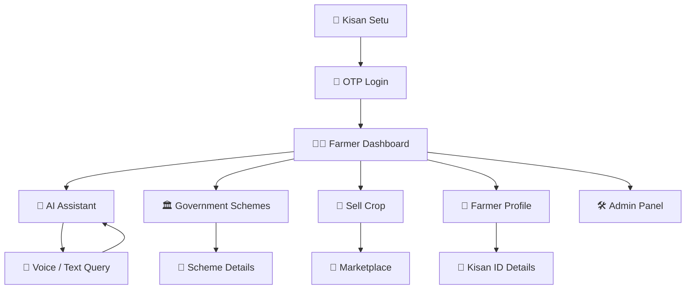
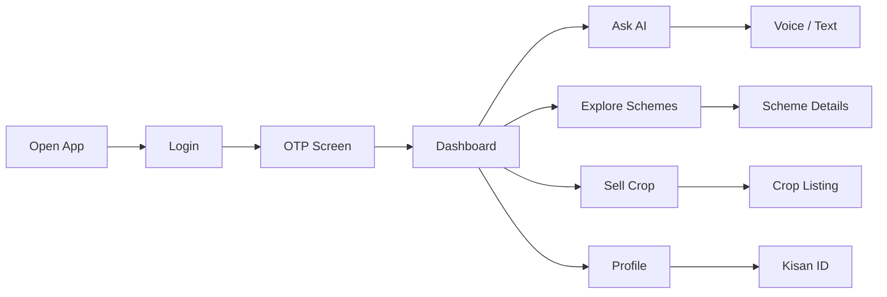
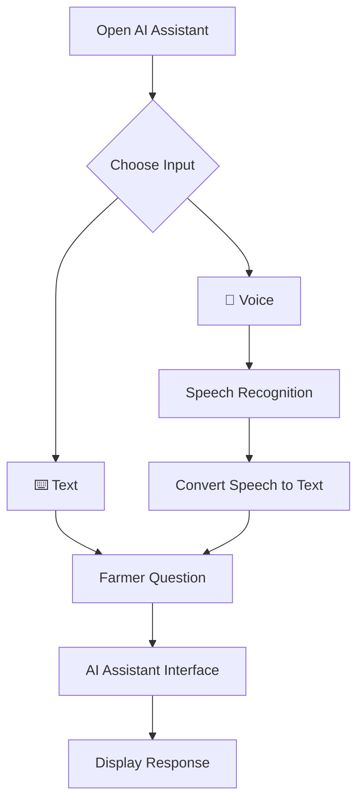

# 🌾 Kisan Setu — Frontend

A **mobile-first React frontend** designed to help Indian farmers easily access digital agricultural services through a simple, accessible, and farmer-friendly interface.

Kisan Setu provides frontend experiences for:

* 🤖 AI Assistant
* 🏛️ Government Scheme Guidance
* 🌾 Crop Selling & Marketplace
* 👨‍🌾 Farmer Dashboard
* 🔐 OTP Login Flow
* 👤 Farmer Profile
* 🛠️ Admin Dashboard

> **Note:** This project is currently frontend-only. Backend services, databases, server-side authentication, and API implementation are not included in this folder.

---

## 🚜 Overview

Kisan Setu is designed to simplify access to agricultural information and digital services.

Farmers can use the frontend to:

* Ask questions in **Hindi or English**
* Interact with an AI assistant
* Explore government schemes
* View scheme information and eligibility
* List crops for sale
* Browse marketplace information
* Manage their farmer profile
* View Kisan ID details
* Access a simple dashboard

The main goal is to create a **clean, accessible, and easy-to-use experience for farmers**, especially on mobile devices.

---

## ⭐ Key Frontend Features

### 🔐 OTP Login

A simple login interface designed around an OTP-based authentication flow.

### 👨‍🌾 Farmer Dashboard

Provides quick access to the most important farmer services.

### 🤖 AI Assistant

A chatbot-style interface where farmers can enter questions using:

* Text input
* Voice input
* Hindi
* English

### 🎤 Voice Support

The frontend can use browser speech APIs to convert spoken questions into text.

### 🏛️ Scheme Explorer

Farmers can browse government agricultural schemes and view relevant information.

### 🌾 Crop Marketplace

Frontend screens for:

* Adding crop listings
* Viewing crop listings
* Managing selling information
* Exploring marketplace content

### 👤 Farmer Profile

Provides a dedicated profile interface for farmer information and Kisan ID details.

### 🛠️ Admin Dashboard

A frontend dashboard for administrative views and management interfaces.

---

# 🔄 Application Flow

The complete frontend user journey can be represented as:



---

# 👨‍🌾 Farmer User Flow



---

# 🤖 AI Assistant Flow



> Voice recognition depends on browser and device support.

---

# 🏛️ Government Scheme Flow


---

# 🌾 Crop Selling Flow


---

# 📁 Frontend Structure

```text
Kisan-Setu/
│
├── frontend/
│   │
│   ├── public/
│   │
│   ├── src/
│   │   ├── assets/
│   │   │
│   │   ├── components/
│   │   │
│   │   ├── pages/
│   │   │   ├── Login/
│   │   │   ├── Home/
│   │   │   ├── Chat/
│   │   │   ├── SellCrop/
│   │   │   ├── Schemes/
│   │   │   ├── Profile/
│   │   │   └── Admin/
│   │   │
│   │   ├── services/
│   │   │   └── api.js
│   │   │
│   │   ├── App.jsx
│   │   ├── main.jsx
│   │   └── index.css
│   │
│   ├── package.json
│   ├── vite.config.js
│   ├── .env.example
│   └── README.md
│
└── README.md
```

---

# 🛠️ Tech Stack

* **React** — Frontend UI
* **Vite** — Development and build tool
* **JavaScript / JSX** — Application logic
* **CSS** — Styling and responsive design
* **Axios** — Frontend API integration
* **Browser Speech APIs** — Voice input
* **Responsive Design** — Mobile, tablet, and desktop support

---

# ⚙️ Setup

### 1. Open the frontend folder

```bash
cd frontend
```

### 2. Install dependencies

```bash
npm install
```

### 3. Start the development server

```bash
npm run dev
```

The application will normally run at:

```text
http://localhost:5173
```

---

# 🚀 Available Commands

### Development

```bash
npm run dev
```

### Production Build

```bash
npm run build
```

### Preview Build

```bash
npm run preview
```

---

# 📄 Main Pages

| Page           | Purpose                            |
| -------------- | ---------------------------------- |
| Login          | OTP login interface                |
| Home           | Farmer dashboard                   |
| Chat           | AI assistant interface             |
| Schemes        | Government scheme explorer         |
| Scheme Details | Scheme information and eligibility |
| Sell Crop      | Crop listing interface             |
| Marketplace    | Crop marketplace UI                |
| Profile        | Farmer information and Kisan ID    |
| Admin          | Administrative dashboard           |


---


# 🌾 Final Goal

The goal of the Kisan Setu frontend is to create a:

**Simple → Accessible → Mobile-first → Farmer-friendly → Professional**

digital experience for accessing agricultural services.

> **Kisan Setu — Making digital agricultural services simpler for farmers.**
